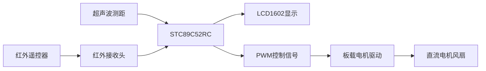

# 51 智能感应遥控风扇

基于 **STC89C52RC** 的单片机学习项目，将超声波测距、红外遥控、LCD1602显示与直流电机PWM调速整合在一起。

靠近时按距离调速，也可以用遥控器切换到固定60%输出。LCD同步显示距离、电源状态、运行模式和输出百分比。

**平台：** STC89C52RC · 12MHz / 12T · Keil C51 · LCD1602 · NEC红外协议

[快速开始](#快速开始) · [功能与操作](#功能与操作) · [硬件接线](#硬件接线) · [软件结构](#软件结构) · [测试与已知问题](#测试与已知问题)

## 项目概览



本项目实现的是**距离触发**，不能区分人和其他障碍物。显示的百分比是PWM占空比，不是实测风量或转速。

## 功能与操作

### 遥控器

| 按键 | 命令码 | 功能 | LCD提示 |
|---|---|---|---|
| 电源 | `0x45` | 切换开启/关闭，重新开启沿用所选模式 | `ON` / `OFF` |
| 数字0 | `0x16` | 直接开启固定60%输出，不受距离影响 | `FIX 060%` |
| 数字1 | `0x0C` | 直接开启自动距离模式 | `AUTO` / `HOLD` |

上电默认自动距离模式，初始输出为0。遥控关闭后，距离变化不会自行启动风扇；按0或1会开启所选模式。

### 自动距离模式

| 测距结果 | 输出策略 |
|---|---|
| 小于20cm | 按现有距离曲线调速：19cm约40%、15cm60%、10cm80%、≤5cm100% |
| 20～40cm，包含端点 | 固定50%，显示 `HOLD 050%` |
| 大于40cm | 停止输出 |
| 短暂无回波 | 暂时保留当前输出 |
| 连续约600ms无回波 | 停止输出 |

`HOLD`在当前版本表示20～40cm内固定50%，并非记忆进入该区间前的风速。近距离曲线保留了原项目行为，因此19cm与20cm处的输出分别为40%和50%。

### 显示示例

自动模式、距离30cm：

```text
D:030cm IR:0C
ON  HOLD 050%
```

按数字0后：

```text
D:030cm IR:16
ON  FIX  060%
```

无回波时距离显示 `---`；`IR:` 后为最近收到的命令，可用于核对不同遥控器的键码。

## 快速开始

### 直接烧录

1. 按下方接线表连接硬件。
2. 下载 [最终固件 fan_auto50_manual60.hex](Obj/fan_auto50_manual60.hex)。
3. 在适用于STC单片机的烧录工具中选择实物芯片 **STC89C52RC** 并烧录。
4. 上电后检查LCD距离显示，再测试遥控开关、自动模式和固定60%模式。

固件按 **12MHz晶振、12T模式** 编写。其他时钟配置需要调整计时参数，不能只修改Keil界面中的晶振数值。

### 从源码编译

1. 使用安装了 **C51工具链** 的Keil uVision打开 [SmartFan.uvproj](SmartFan.uvproj)。
2. 选择 `SmartFan` 目标，执行 **Rebuild**。
3. 输出文件为 `Obj/fan_auto50_manual60.hex`。

工程使用兼容器件配置 `AT89C52`，实际烧录对象是STC89C52RC。`SmartFan.uvopt` 为本机界面/调试选项，不纳入仓库；缺少该文件不影响工程依赖。

## 硬件接线

所用硬件为STC89C52RC实验板、TRIG/ECHO接口超声波模块、LCD1602、NEC遥控器及接收头、直流电机小风扇和板载驱动电路。

| 器件/信号 | 接口 |
|---|---|
| 超声波TRIG | **P1.4** |
| 超声波ECHO | **P1.1** |
| 电机驱动输入IN1 | **P1.0** |
| 电机两根线 | 本项目开发板 **J47的5V与O1/OUT1** |
| 红外接收信号 | **P3.2 / INT0** |
| LCD D0～D7 | **P0.0～P0.7** |
| LCD RS | **P2.6** |
| LCD RW | **P2.5** |
| LCD E | **P2.7** |

- 超声波、LCD及单片机共地，供电按实物模块要求连接。
- **P1.0已用于电机驱动，不能再连接超声波TRIG。**
- 电机通过驱动电路连接，不能直接接到单片机IO。J47等编号只适用于本项目的开发板，其他板卡请核对原理图。
- 修改接线前先断电。LCD背光与对比度沿用开发板原有连接。

## 软件结构

```text
.
├── SmartFan.uvproj           # Keil C51工程
├── README.md                # 项目说明
├── User/
│   └── main.c               # 测距、按键调度、LCD显示缓存
├── App/
│   ├── fan/                 # 运行模式、距离策略、PWM
│   ├── ired/                # NEC红外解码与命令队列
│   └── lcd1602/             # LCD1602驱动
├── Public/                  # 公共类型与延时
├── Obj/
│   └── fan_auto50_manual60.hex
└── Tests/                   # 主机逻辑测试
```

| 资源 | 用途 |
|---|---|
| Timer0 | 红外下降沿间隔计时 |
| INT0 | 红外接收，解析NEC/扩展地址NEC帧 |
| Timer1 | 超声波回波计时 |
| Timer2 | 250μs节拍、200Hz电机PWM、毫秒时钟 |

红外中断优先级高于PWM。主循环处理遥控事件并周期测距；LCD只更新变化的字符，正常运行期间不反复清屏。写入LCD后清空P0，减少共用端口造成的数码管误亮。

## 测试与已知问题

安装Python 3和GCC，并确保 `gcc` 位于PATH。在项目根目录执行：

```powershell
python Tests/test_fan.py
python Tests/test_ired.py
python Tests/test_remote_lcd.py
```

测试直接使用项目C代码并模拟寄存器，覆盖距离边界、50%/60%模式、遥控开关、PWM、测距超时、NEC解码和LCD文字联动；它们不能替代真实中断时序、供电与电机负载测试。

- 工程已通过本机Keil uVision加载及全量编译，最终固件与源码重建结果一致。
- 链接存在两个未使用函数警告：`lcd1602_clear`、`delay_10us`，无编译错误。
- 实物曾出现“电机输出增大时LCD背光变暗”，尚未确认解决。程序没有背光调光功能，需继续排查共用电源压降、驱动和电机干扰。
- 更换遥控器时，需要根据LCD显示的命令码调整 `App/fan/fan.h`。

本仓库不包含Keil、STC烧录工具或开发板厂家资料；LCD与公共驱动沿用原有单片机实验代码。
